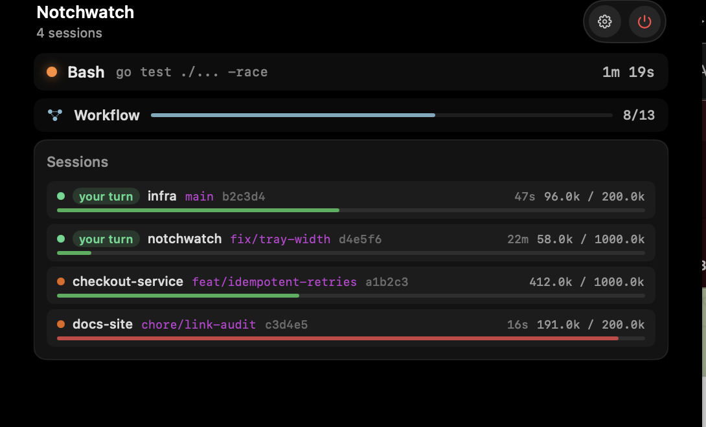
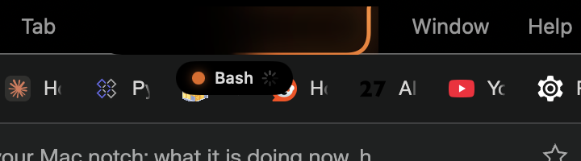
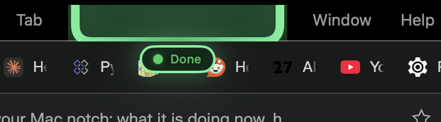
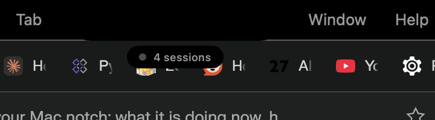

# Notchwatch

Claude Code session state in the notch of your Mac.

Notchwatch is a menu-bar/notch companion for [Claude Code](https://claude.com/claude-code). It sits in the notch (or the menu bar on Macs without one) and shows what the agent is doing right now: the tool it is running, whether it is thinking, whether it is waiting for a permission decision, the current todo list, elapsed time, git branch, token usage and how much of the context window is left.



Closed — which is how it spends almost all of its time — the panel collapses to one capsule under the cut-out, and the outline carries the state:

| | |
|---|---|
|  | **Working.** The tray names the running tool; the border sweeps orange while anything is under way. |
|  | **Your turn.** A session handed control back. The green is steady rather than sweeping, and holds until you look — opening the panel is what clears it. |
|  | **Idle.** Sessions open, nothing owed in either direction. No border at all. |

All screenshots are the demo fixture rather than a real desktop — see [Screenshots](#screenshots).

It watches local files only. It is not a client for anything, it holds no credentials, and it makes no network requests — there is no `URLSession`, no `Network` import and no socket anywhere in `Sources/`, and the app ships with an empty entitlements file.

## Scope

Claude Code, and nothing else. Support for OpenAI Codex was removed on purpose — see [Origin](#origin) — because one well-understood data source beats two half-supported ones.

## Where the data comes from

Two sources, and the app works with either one alone:

- **The transcript** (`~/.claude/projects/**/*.jsonl`), always. It is the only place token usage and the model id appear.
- **Hooks**, optionally. Registering them in Settings makes tool starts, permission prompts and session boundaries arrive at the moment they happen instead of when the transcript is next flushed. Nothing is written to your Claude Code settings without pressing that button and confirming a dialog that names the file. See [docs/hooks.md](docs/hooks.md).

## Install

Builds are published as a `.dmg` on the [Releases](https://github.com/sanchpet/notchwatch/releases) page; drag the app to `/Applications`.

No release has been published yet — the current version is `0.0.0`. Until the first one lands, build it yourself: see [Development](#development), it takes about a minute.

There is no Homebrew cask. A cask installs with quarantine set, so it is only worth having once builds are signed — see [Signing](#signing-and-notarization).

## Requirements

- macOS 14.0 (Sonoma) or later.
- Claude Code, with its transcripts in the default location (`~/.claude/projects/`).
- A Mac with a notch gets the notch UI; every other Mac falls back to the menu bar.

## Signing and notarization

Releases are built by CI in one of two modes, decided by whether an Apple Developer ID certificate is available to the workflow:

- **Signed and notarized.** The app is signed with a Developer ID under the hardened runtime, notarized by Apple and stapled; the DMG is signed and stapled too. It opens on double-click and Gatekeeper stays quiet.
- **Unsigned.** The app carries an ad-hoc signature only. The artifact name ends in `-unsigned` and the release notes say so.

An unsigned build downloaded from the internet is quarantined, and macOS will not let it through on the first attempt. Depending on the build you will see *"Apple could not verify "Notchwatch" is free of malware"* or *""Notchwatch" is damaged and can't be opened"*. The old workaround — right-click → **Open** — no longer clears this on macOS 15 (Sequoia) and later; that path was removed.

To open it anyway:

1. Double-click the app once and dismiss the warning.
2. Open **System Settings → Privacy & Security**, scroll to the Security section, and press **Open Anyway** next to the message naming the app.
3. Confirm, and authenticate.

Or clear the quarantine attribute from a terminal, which does the same thing without the round trip:

```bash
xattr -dr com.apple.quarantine /Applications/Notchwatch.app
```

Do this only if you trust the source of the build. If you would rather not, build it yourself.

## Origin

This is a fork of [AppGram/agentnotch](https://github.com/AppGram/agentnotch).

Upstream ships no licence file; its README declares `MIT License — see [LICENSE](LICENSE) for details.` and the link points at a file that is not in the repository. The inherited code is MIT on the strength of that declaration, and [LICENSE](LICENSE) says so in exactly those terms rather than pretending to reproduce a file that never existed. The fork's own work is BSD 3-Clause. Two vendored files keep their own licences: `CGSSpace.swift` is MPL-2.0 (from Parrot) and `NotchShape.swift` is MIT under a separate copyright (from DynamicNotchKit).

Removed:

- **The claude.ai credential path.** Upstream asked the user for a claude.ai `sessionKey`, stored it (together with a Cloudflare `cf_clearance` clearance cookie) in the Keychain, and used them to call `https://claude.ai/api/organizations/...` while impersonating a browser — a spoofed Chrome `user-agent`, `origin: https://claude.ai`, `anthropic-client-platform: web_claude_ai`, `sec-fetch-site: same-origin`. That is a session-hijacking shape: it is not a public API, the credential is the user's whole web session, and shipping it under a signature is not defensible. The entire path is gone, along with the Keychain helper that existed to serve it.
- **OpenAI Codex support**, and the OTLP receiver it needed — an HTTP server listening on port 4318 by default to decode protobuf metrics, plus the two package dependencies behind it (`opentelemetry-swift` and `swift-protobuf`) and their transitive graph. The app now has no external dependencies at all.
- **The MCP process manager and JSON-RPC cluster** (2,504 lines across 17 files), the Xcode-build UI it fed, and the `AppMode` switch that selected between it and the Claude Code UI. Upstream kept both halves of the app alive behind a constant; only one half was ever reachable.
- **The bundled "meme video".** A setting shipped with a hardcoded `googlevideo.com` playback URL as its default and fed it straight to `AVPlayer`. The URL embedded a third party's residential IPv6 address and signed playback tokens, and it was the only reason the app ever touched the network. The setting, the URL, the toggle and the player are gone.

Changed:

- Renamed, with a new bundle identifier. The upstream name belongs to someone else, upstream already advertises a Homebrew cask under it (`brew tap AppGram/tap`), and its two bundle ids contradicted each other — the Xcode project said `com.nedimfakic.AgentNotch` while `Info.plist` said `com.appgram.agentnotch`.
- Built by SwiftPM. The Xcode project is gone; `swift build` plus `scripts/build-app.sh` is the only description of how the app is assembled, and CI runs that same script.
- Tool lists are folded from every live session instead of a single `selectedSession` that upstream only ever assigned when exactly one session existed — so with an editor holding an IDE lock next to a terminal session, the normal case, the published state stayed default-constructed and the tool list was permanently empty.
- The context bar has one definition of context: `input + cache_read + cache_creation` tokens against a window derived from the model in use (including the `[1m]` long-context variants), and floored by the largest prompt the session has actually sent, instead of a hardcoded 200k that had to be corrected by hand in settings.
- The git branch badge is resolved from the session's working directory by reading `.git/HEAD`, not taken from a field in the transcript that reported the literal string `HEAD` on detached checkouts.
- Notch geometry is read from the display's own `auxiliaryTopLeftArea`/`auxiliaryTopRightArea` and recomputed when the display configuration changes, rather than measured once at launch.
- Hook support (above) is new; upstream had none.

## Screenshots

Every pixel of the panel reports on the user's own work — project names, branches, the command being run, the first line of what the agent just said. A screenshot of real use is therefore a screenshot of somebody's private activity, so the app can fabricate a session set instead:

```sh
Notchwatch.app/Contents/MacOS/Notchwatch --panel demo-on
Notchwatch.app/Contents/MacOS/Notchwatch --panel open
# … capture …
Notchwatch.app/Contents/MacOS/Notchwatch --panel demo-off
```

The fixture lives in `Sources/Notchwatch/Core/ClaudeCode/DemoScenario.swift`. It also reaches states real work will not pose on request: a session nearly out of context, one waiting on you, a workflow half finished.

## Driving the panel

The panel opens by clicking it, and by asking:

```sh
Notchwatch --panel open|close|toggle|peek
```

Deliberately not implemented with synthesised clicks. Doing that needs macOS Accessibility, which cannot be scoped to one application — it is the right to send input into any window on the machine. An app may show its own panel without any permission at all, so it is asked directly. The transport is a distributed notification, so nothing is written to disk.

The command waits to be told it landed, and **exits non-zero if it never is** — no instance running, or one that cannot show a panel because no attached display has a cut-out. It repeats itself until then, which is what makes a command sent at an app that is still starting arrive rather than disappear. A running app answers in tens of milliseconds; the wait is only paid in full when nothing is listening (2 s). Scripts that call this on a machine where the app may be absent should tolerate the exit status.

```sh
Notchwatch --version    # version, build number and when this binary was built
```

`--version` describes the file on disk. The running app reports the same stamp in its settings window and menu bar popover, so the two can be compared: assembling the bundle deletes it first, and `open` reactivates an instance that is already running, so a rebuilt app on disk and an old one on screen look identical otherwise.

## Development

No full Xcode is needed; Command Line Tools are enough.

```bash
swift build                 # debug build
swift build -c release      # release build
scripts/build-app.sh        # assemble Notchwatch.app from the release binary
```

Tooling is installed with [mise](https://mise.jdx.dev):

```bash
mise install                # SwiftLint and friends, pinned in mise.toml
mise run lint               # swiftlint --strict + swiftformat --lint, what CI runs
mise run bundle             # the same as scripts/build-app.sh
```

Hooks:

```bash
pre-commit install          # once per clone
pre-commit run --all-files  # what CI checks, run everything
```

Run the linter over the whole tree before pushing — CI lints the whole repository, while the commit hook only sees changed files.

Contributions: see [CONTRIBUTING.md](CONTRIBUTING.md).

## License

BSD 3-Clause for this fork's work, MIT for the code inherited from AgentNotch, plus two vendored files under their own terms. Full text and attribution in [LICENSE](LICENSE).
